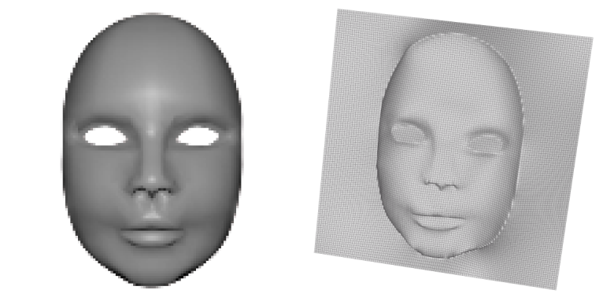
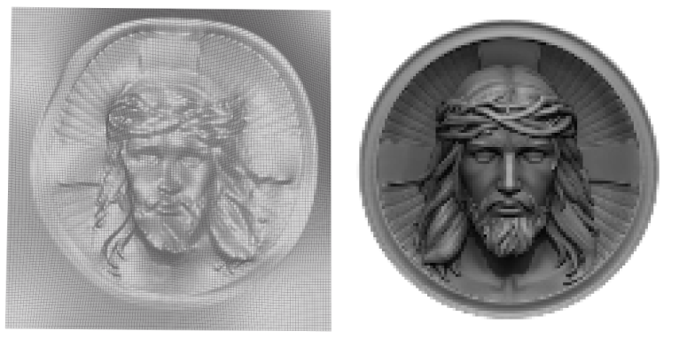
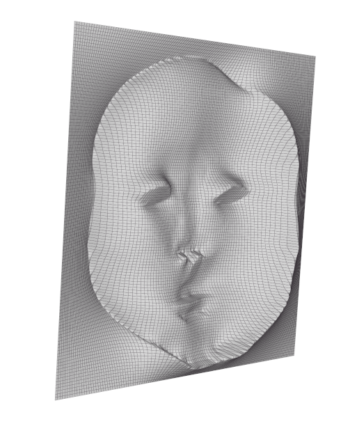

# Shape from shading
# Preview





---

## Description
Find a code allowing you to transform your image into a 3D surface.
#### Librairies

- Algorithme BFGS

#### Installation

Install Vizir to Visualize the result

## Compile

```
g++ -o main -Iinclude -Isrc src/main.cpp src/matrice.cpp src/conversion_image_matrice.cpp
```

g++ src/main.cpp src/conversion_image_matrice.cpp src/matrice.cpp src/vecteur.cpp src/lbfgs.cpp -o main.exe

## Remarques
Les images a fort contraste ne convergent pas. En général l'algorithme converge mieux avec un fond blanc.

## Les Limites
### Problèmes de symétrie
L'algorithme choisit un peu aléatoirement entre convexité et concavité.
